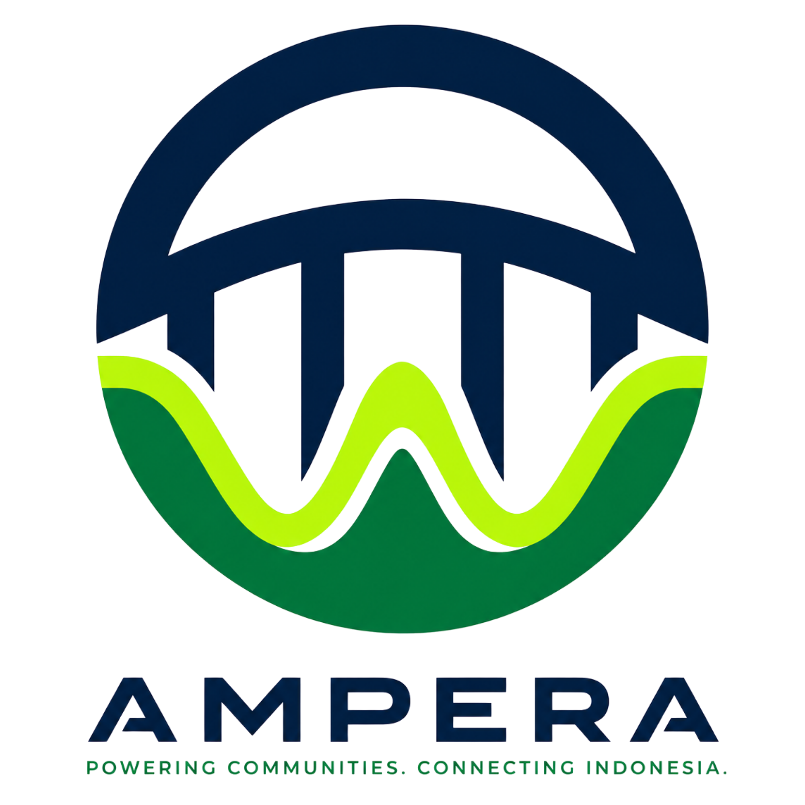

<div align="center">
  
  <h1>Ampera — Jembatan Energi untuk Nusantara</h1>
  <p><b>Platform <i>Crowd-Equity</i> & Tokenisasi Aset Dunia Nyata (RWA) untuk Elektrifikasi 10.068 Desa 3T Indonesia.</b></p>
</div>

<br />

## 🌟 Visi Kami
**Ampera** adalah sebuah inovasi radikal untuk menyelesaikan masalah kelistrikan di daerah Tertinggal, Terdepan, dan Terluar (3T) di Indonesia. Kami memadukan kecerdasan buatan (AI), teknologi *blockchain* (RWA), dan energi bersih (Piko-Hidro, Surya, Biomassa) ke dalam satu platform *crowd-equity* yang transparan, mudah diakses, dan menguntungkan.

Setiap **1 kWh** energi bersih yang dihasilkan menjadi dividen langsung bagi investor mikro (warga lokal) maupun institusi, sekaligus meringankan beban subsidi diesel (PLTD) dari PLN.

---

## ✨ Fitur Utama

### 🌍 **Nusantara 3D Globe (Interactive Audit)**
Pemetaan interaktif berbasis **Three.js** untuk melihat data real-time potensi desa 3T di seluruh Indonesia. Pengguna dapat merotasi globe secara bebas, menyeleksi desa, dan melihat detail audit kapasitas energi, prediksi *Return on Investment* (ROI), serta status integrasi (PLN LISDES).

### 🛣️ **Scrollytelling 3D Pipeline**
Perjalanan visual *Apple-style scrollytelling* yang mulus dan memukau. Sistem WebGL 60-FPS yang dioptimalkan dengan cermat ini akan memandu audiens melintasi 7 Stasiun Alur Kerja Ampera, mulai dari Analisis Data Satelit (AI Tetrix) hingga distribusi aliran dana (DeFi DEX).

### 🏛️ **Tiga Pilar Solusi Utama**
1. **Pilar 01: Ampera Flex** — Solusi energi bersih agnostik 24/7 (Piko-Hidro, Surya PV+BESS, Biomassa) yang disesuaikan secara otomatis oleh AI berdasarkan kondisi geografis desa.
2. **Pilar 02: Integrasi PLN** — Off-taker terintegrasi yang mampu mengeliminasi kerugian subsidi diesel hingga Rp 135.000 per rumah tangga setiap bulan.
3. **Pilar 03: RWA & DeFi** — Tokenisasi hak bagi hasil menggunakan standar ERC-6909 dan dilindungi oleh *Bid Wall Hook* pada Uniswap v4.

---

## 🛠️ Tech Stack

Platform inovatif ini dibangun di atas infrastruktur web modern dengan fokus pada performa *rendering* dan imersi visual kelas tinggi:

- **Framework**: Next.js 15 (App Router) + React 19
- **3D Graphics**: Vanilla Three.js (WebGL) dengan *Custom Shaders & Catmull-Rom Splines*
- **Styling & UI**: Tailwind CSS v4, Framer Motion
- **Language**: TypeScript
- **Optimization**: Intersection Observer API (Smart GPU pausing), Native Scrollbar hiding

---

## 🚀 Getting Started

Ikuti langkah-langkah di bawah untuk menjalankan Ampera di lingkungan pengembangan (local environment):

1. **Clone repository ini**
   ```bash
   git clone https://github.com/agadape/Ampera_chain.git
   cd Ampera_chain
   ```

2. **Install dependencies**
   ```bash
   npm install
   # atau yarn install / pnpm install
   ```

3. **Jalankan Development Server**
   ```bash
   npm run dev
   ```

4. **Buka di Browser**
   Buka [http://localhost:3000](http://localhost:3000) untuk melihat platform.

---

<div align="center">
  <b>Mari Menyalakan Terang untuk Nusantara.</b><br/>
  PLN Innovation & Clean Energy (ICE) 2026
</div>
